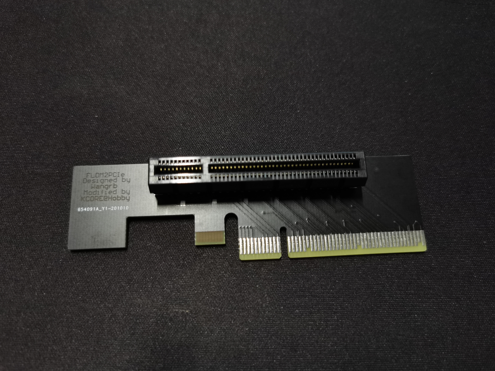

# KCORES-FlexibleLOM-Adapter-1U

  

KCORES FlexibleLOM 转 PCIe x8 转接卡开源设计1U直角转接版本，可以让普通电脑主板的 PCIe 槽使用 FLR 系列网卡，包括常见的千兆、万兆、40G网卡。

四层PCB设计，经过阻抗计算。

[KCORES 网站](http://kcores.com/)

HomeLab 交流 QQ 群： 826702309

# Tested FLR List

| FlexibleLOM  | NIC Model               | Connectors        | Results |
| ------------ | ----------------------- | ----------------- | :-----: |
| 331FLR       | BCM5719                 | Quad RJ45 GbE     | ❌     |
| 366FLR       | intel i350              | Quad RJ45 GbE     | ✔      |
| CX3 ALOM     | Mellanox ConnectX-3     | Single SFP+ 10GbE | ✔      |
| 544FLR-QSFP  | Mellanox ConnectX-3     | Dual QSFP+ 40GbE  | ✔      |
| 544+FLR-QSFP | Mellanox ConnectX-3 Pro | Dual QSFP+ 40GbE  | ✔      |
| 561FLR-T     | intel X540              | Dual RJ45 10GbE   | ✔      |

# 傻瓜生产指南

下载Releases中最新的zip文件

提交至嘉立创助手下单，设置PCB为4层板，厚度为1.6，板子宽度（cm）：2.77，板子长度（cm）：9.63

需要阻抗，JLC7628结构

其余全部默认

# Thanks To

- [@Wangrb (Original Adapter Card Design)](https://github.com/Wangrb)
- [@AlphaArea (Main Contributer)](https://github.com/alphaarea)
- [@MistyMoonR (3D Model)](https://github.com/MistyMoonR)  
- [@Karminski (Photo)](https://github.com/karminski)
